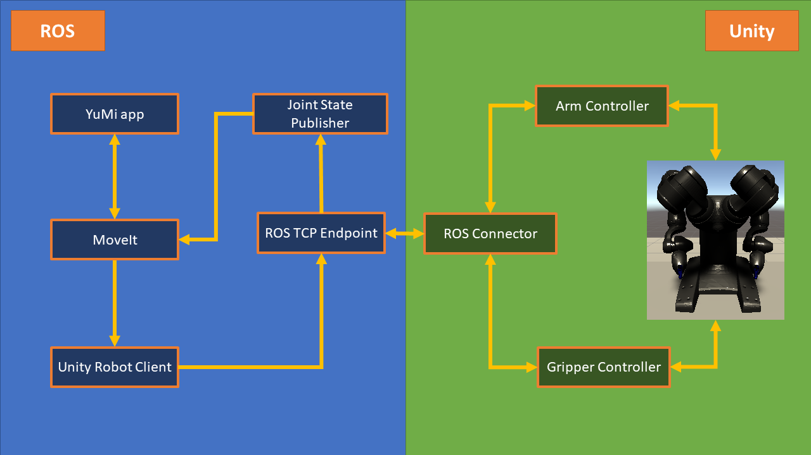

# Unity Robotics Demo - Using Unity like Gazebo!

Forked from [Unity Robotics Hub](https://github.com/Unity-Technologies/Unity-Robotics-Hub).

<p align="center">
  
</p>

---
## Prerequisites
**0. Tested on Ubuntu 18.04 with ROS melodic and Unity 2020.2.0b9**

**1. [Install ROS melodic](http://wiki.ros.org/melodic/Installation/Ubuntu)**

**2. Install Unity 2020.2.0b9**  <br>
If you are using Linux, you may need to Download Unity3D archive versions by:

1. Go to the [download page](https://unity3d.com/unity/beta/2020.2.0b9) of the archive version.
2. Right click the green button `install with unity hub` to copy its link address.
3. CD to Unity Hub directory and start Unity hub with command: `./UnityHub.AppImage <link address>`.

**3. Downloading this demo to your local directory** <br>
```
    git clone https://github.com/HainingLuo/UnityRoboticsDemo.git
```

## Setting up ROS workspace  <br>
This demo uses [ABB YuMi® - IRB 14000](https://new.abb.com/products/robotics/industrial-robots/irb-14000-yumi). Executing following codes will download the ROS package for yumi and a ROS TCP Endpoint. 
```
    cd UnityRoboticsDemo/unity_ws/src
    git clone https://github.com/Unity-Technologies/ROS-TCP-Endpoint.git
    git clone https://github.com/ImperialCollegeLondon/yumi-prl
    cd yumi-prl && git checkout melodic && bash installDependencies.sh
    cd ../.. && catkin_make -DCMAKE_BUILD_TYPE=Release && source devel/setup.bash
```
Don't close your terminal for now.
## Setting up Unity  <br>
1. Open your Unity Hub.
2. Click `ADD` on the topright section of your Unity Hub window, navigate to the location of this demo, choose `UnityMoveItProject` and click `OK`.
3. Click to open the newly `UnityMoveItProject`. It may take a while for Unity to import required packages.

## Running this demo  <br>
0. \[Optional\] Running both RViz and Unity can be slow on some computers, you can turn off RViz by going to `UnityRoboticsDemo/unity_ws/src/unity_interface/unity_connection/launch` and change `<arg name="rviz" default="true" />` to `<arg name="rviz" default="false" />`
1. Go back to your terminal, 
```
    roslaunch unity_connection demo_unity.launch
```
2. Click the play button in Unity to start simulation.
3. Open a new terminal from the workspace directory (Press Ctrl+ALt+T from your previous terminal)
```
    source devel/setup.bash
    roslaunch yumi_app yumi_app.launch
```
4. Visualise each motion in RViz. Type `y` in the terminal running `yumi_app` and enter to execute them in Unity.

## Using your own robot
### Structure of this demo
<p align="center">
  
</p>

The package `YuMi app` is the application designed for robot YuMi. However, you can replace it with other applications using MoveIt for your own robot. Plaese refer to [MoveIt Tutorial](http://docs.ros.org/en/melodic/api/moveit_tutorials/html/index.html) for more information. Once command `execute()` is given from MoveIt, robot trajectory will be published by MoveIt and subscribed by `Unity Robot Client`, which is a simplified action server. The server then send the trajectory to Unity via `ROS TCP Endpoint`.

Within Unity, the `Arm Controller` is in charge of receiving arm trajectories and deploy them at each joint motor, as well as publishing joint states of corresponding arms. `Gripper Controller` does the same thing but for grippers.
### How to import you robot to Unity
To import your robot, 

1. Copy your robot URDF folder to `Assets` folder in the Unity Project. Note that the hierarchy might be different from your `robot_description`. Check the URDF from demo project and see if your file hierachy is correct.
2. In Untiy, go to `GameObject/3D Object/URDF Model (import)` navigate to your `.urdf` file and click `Open`. In the new `URDF Import Settings`, click `Import URDF`. It may take a while for Unity to load the robot model.
3. Check Inspector properties (right side of the scene view) of your robot Game Object. Change controller parameters to fit your own robot.
4. From the hireachy window (left side of the scene view), naviage to your robot base link, and tick the `Immovable` property of its Articulation Body component in the Inspector window.
5. Select the `RosConnect` Object, delete previous controllers and add new controller component for your own robot. Drag your robot asset to the `Arm` slot of your controller script. The arm controller script will automatically find all revolute joints connected to this robot link. Note for dual arm robots, you will need two arm controllers for two arms, and make sure the link you drag to controller scripts does not contain more than one branch. Gripper controller, instead, finds all prismatic joints.
6. Change the `Arm Name` and `Gripper Name` to match the namespace of your move group.

### How to adapt the ROS package for your robot

0. Make a ROS package for your robot that can work on real robots.
1. Modify the config file under `unity_interface/unity_connection`. change your arm name to match the namespace of your move group.

After modifying aforementioned files, you should be able to simulate your robot in Unity! Have fun!
