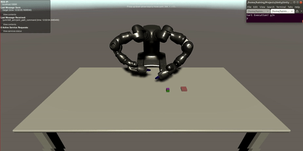

# Unity Robotics Demo

Use Unity like Gazebo!

<p align="center">
  
</p>

---
## Prerequisites
**0. Tested on Ubuntu 18.04 with ROS melodic and Unity 2020.2.0b9**

**1. [Install ROS melodic](http://wiki.ros.org/melodic/Installation/Ubuntu)**

**2. Install Unity 2020.2.0b9**  <br>
If you are using Linux, you may need to Download Unity3D archive versions by:  <br>
1. Go to the [download page](https://unity3d.com/unity/beta/2020.2.0b9) of the archive version.
1. Right click the green button ‘install with unity hub’ to copy its link address.
1. CD to Unity Hub directory and start Unity hub with command: `./UnityHub.AppImage <link address>`.

**3. Downloading this demo to your local directory** <br>
```
    git clone https://github.com/HainingLuo/UnityRoboticsDemo.git
```

## Setting up ROS workspace  <br>
This demo uses [ABB YuMi® - IRB 14000](https://new.abb.com/products/robotics/industrial-robots/irb-14000-yumi). Executing following codes will download the ROS package for yumi and a ROS TCP Endpoint. 
```
    cd unity_ws/src
    git clone https://github.com/Unity-Technologies/ROS-TCP-Endpoint.git
    git clone https://github.com/ImperialCollegeLondon/yumi-prl
    cd yumi-prl && git checkout melodic && bash installDependencies.sh
    cd ../..
    cd .. && catkin_make && source devel/setup.bash
```
Don't close your terminal for now.
## Setting up Unity  <br>
1. Click "ADD" on the topright of your Unity Hub window, navigate to the location of this demo and choose "UnityMoveItProject". It may take a while for Unity to load required packages.

## Running this demo  <br>
0. Optional: Running both RViz and Unity can be slow on some computers, you can turn off RViz by going to `/home/haining/Projects/Unity/UnityRoboticsDemo/unity_ws/src/unity_interface/unity_connection/launch` and change `<arg name="rviz" default="true" />` to `<arg name="rviz" default="false" />`
1. Go back to your terminal, 
```
    roslaunch unity_connection demo_unity.launch
```
2. Click the play button in Unity to start simulation.
3. Open a new terminal from the workspace directory
```
    source devel/setup.bash
    roslaunch yumi_app yumi_app.launch
```
4. Visualise each motion in RViz. Type in 'y' and enter to execute them in Unity.

## Using your own robot
### Structure of this demo
### How to import you robot to Unity
### How to adapt the ROS package for your robot
